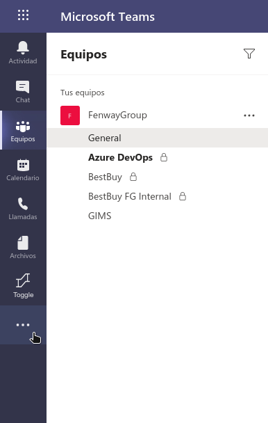

# Microsoft Teams - Left Bar Toggle

This is a simple Chrome Extension to allow manual toggling of the left sidebar in the Microsoft Teams web application.

## Installation
Clone this repository locally. Then, navigate to [chrome://extensions/](chrome://extensions/), choose to **Load unpacked**, and choose the folder where you cloned this repository.

## Usage
Upon loading the extension into Chrome, a new button will appear on your left sidebar in Microsoft Teams. Click this button to toggle the sidebar open and closed.

